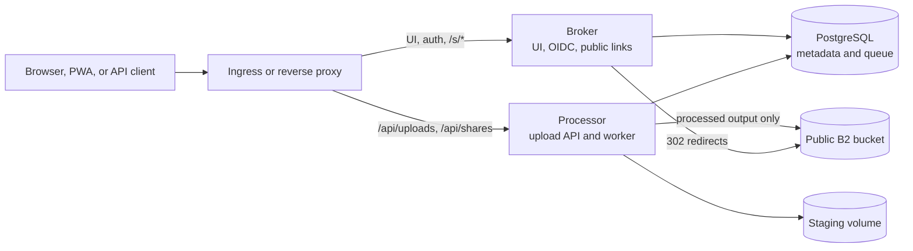

<p align="center">
  
</p>

<h1 align="center">b2-share-broker</h1>

<p align="center">
  Turn files into stable, unlisted links backed by Backblaze B2.
</p>

<p align="center">
  <a href="https://github.com/unixfg/b2-share-broker/actions/workflows/ci.yaml"></a>
  <a href="https://github.com/unixfg/b2-share-broker/pkgs/container/b2-share-broker"></a>
  <a href="https://github.com/unixfg/b2-share-broker/tree/main/chart"></a>
  
</p>

`b2-share-broker` is a self-hosted web share app for publishing one file at a
time. It gives users a share URL immediately, processes uploads in the
background, and sends download traffic directly to a public Backblaze B2
bucket.

The browser app works as an installable PWA and Android share target. The HTTP
API supports the same upload, history, rename, and delete workflow with OIDC
bearer tokens.

> [!IMPORTANT]
> Share links are unlisted, not private. Anyone with a `/s/{slug}` URL can open
> it without authentication.

## Why B2 Share?

- **Stable permalinks** keep working after a share is renamed.
- **Fast public downloads** redirect clients to B2 instead of proxying bytes
  through the application.
- **Web-friendly video** remuxes compatible media or normalizes it to H.264/AAC
  MP4 with NVIDIA NVENC.
- **Rich link previews** provide Open Graph video, image, dimensions, and
  thumbnail metadata for common chat crawlers.
- **Content deduplication** reuses both identical stored objects and previously
  processed derivatives.
- **OIDC access control** supports browser sessions and bearer-token clients.
- **Complete deletion** removes every B2 object version and hide marker when the
  last share is deleted.

## How It Works



Uploads stream to temporary staging storage. A queue worker handles one job at
a time per processor, hashes the final bytes, and uploads a content-addressed
object to B2. Original upload bytes never enter the public bucket.

[Read the architecture guide](docs/architecture.md) for processing, storage,
deduplication, and deletion details.

## Quick Start

You need an external OIDC provider, a public Backblaze B2 bucket, B2 application
credentials, and Docker Compose.

```bash
cp .env.example .env
# Fill in the OIDC, B2, database, and session settings in .env.
docker compose up
```

Open `http://localhost:8080`. The landing page links to the browser uploader at
`/share` and the built-in API examples at `/docs`.

The Compose stack does not expose an NVIDIA GPU by default. Non-video files and
videos that can be remuxed as H.264/AAC work; videos that require transcoding
need NVENC-enabled container access.

[Follow the deployment guide](docs/deployment.md) for prerequisites, Keycloak,
Compose, Helm, Kubernetes secrets, GPU configuration, and production pinning.

## Install With Helm

The OCI chart deploys the broker, processor, staging storage, and optionally a
CloudNativePG cluster.

```bash
helm install b2-share-broker oci://ghcr.io/unixfg/b2-share-broker \
  --version 0.1.2 \
  --namespace b2-share-broker \
  --set namespace.create=false \
  -f values.yaml
```

The default values are deployment scaffolding, not a ready-to-run production
configuration. Create the namespace and required secrets first, then set your
public URL, OIDC issuer, storage classes, B2 backup destination, and ingress
before installing.

See the [chart reference](chart/README.md) for all values.

## Documentation

| Guide | Covers |
|---|---|
| [Documentation index](docs/README.md) | All guides, references, and historical notes |
| [User guide](docs/user-guide.md) | Browser uploads, PWA sharing, names, history, and public links |
| [API reference](docs/api.md) | Authentication, endpoints, requests, and responses |
| [Architecture](docs/architecture.md) | Components, processing pipeline, storage, and object lifecycle |
| [Configuration](docs/configuration.md) | Environment variables, defaults, aliases, and validation |
| [Deployment](docs/deployment.md) | Compose, Helm, OIDC, B2, Postgres, and GPU setup |
| [Operations](docs/operations.md) | Health, migrations, troubleshooting, backups, and deletion checks |
| [Development](docs/development.md) | Repository layout, builds, tests, and contribution workflow |

## Project Status

The current release accepts one file per upload and publishes Linux AMD64
container images. Native iOS and macOS share extensions are not included;
Apple users can use the browser interface.
