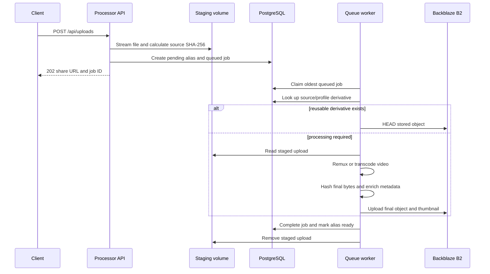

# Architecture

`b2-share-broker` separates the browser and public-link workload from the
stateful upload and media-processing workload. All binaries come from one Go
module and ship in one container image.

## Runtime Components

### Broker

`/usr/local/bin/b2-share-broker` serves:

- the landing page, upload PWA, and built-in docs;
- OIDC login, signed browser sessions, and bearer-token verification;
- share history and management APIs when routed to it;
- public share status pages, Open Graph pages, and B2 redirects.

The broker is stateless apart from PostgreSQL and can run with multiple
replicas. Browser sessions are signed cookies, so ingress affinity is not
required.

### Processor

`/usr/local/bin/b2-share-processor` runs two activities in one process:

- an HTTP API with long timeouts for streaming uploads to staging storage;
- one queue worker that claims and processes jobs serially.

Database claims use `FOR UPDATE SKIP LOCKED`, so multiple processor processes
can claim different jobs. The supported default topology uses one processor to
match the RWO staging volume and avoid duplicate concurrent video work.

### Compatibility Worker

`/usr/local/bin/b2-share-transcoder` runs only the queue worker. It exists as a
compatibility entrypoint; the processor is the normal deployment unit.

### PostgreSQL

PostgreSQL stores:

- current, retired, and deleted aliases;
- content-addressed object metadata;
- processing jobs and their staging paths;
- source-to-derivative mappings;
- redirect counters and timestamps.

Every binary runs the same advisory-locked, idempotent migration sequence at
startup.

### Backblaze B2

B2 stores only final objects and extracted video thumbnails. Public requests
receive redirects to `B2_PUBLIC_BASE_URL`; neither broker nor processor proxies
download bytes.

The bucket must already exist and be publicly readable. Application credentials
use the S3-compatible API for object upload, `HEAD`, version listing, and
version-specific deletion.

## Request Routing

The intended public routing is:

| Path | Service | Reason |
|---|---|---|
| `/api/uploads`, `/api/uploads/*` | Processor | Requires staging storage and long upload timeouts |
| `/api/shares`, `/api/shares/*` | Processor | Keeps deletion and staging cleanup with the processor |
| Everything else | Broker | UI, OIDC, history page, public shares, and unfurls |

Both HTTP binaries register the shared route set, but only the broker configures
interactive OIDC login. Correct ingress routing remains important because the
broker does not mount staging storage in the Helm deployment.

## Upload Lifecycle



The upload handler:

1. Authenticates the browser session or bearer token.
2. Enforces CSRF for session-backed requests.
3. Limits the request and accepts exactly one multipart `file`.
4. Streams bytes directly to a temporary file under `STAGING_DIR`.
5. Calculates the source SHA-256 during that stream.
6. Atomically renames the completed temporary file.
7. Selects a processing profile and final extension.
8. Creates a pending alias and queued job in one database transaction.
9. Returns the future public URL immediately.

## Processing Profiles

### Regular Files

The `upload-finalize` profile hashes the staged file and stores it without media
conversion.

### Video

Filename extensions and MIME types identify common video formats. The
`mp4-web` profile always produces `.mp4` and first tries a stream-copy remux:

```bash
ffmpeg -hide_banner -y -i input -map 0 -c copy -movflags +faststart output.mp4
```

The worker probes the result and accepts it when video is H.264 and every audio
stream is AAC. Otherwise it transcodes the first video and optional first audio
stream to:

- H.264 through `h264_nvenc`, preset `p4`, CQ 23;
- AAC at 160 kbps;
- `yuv420p` fast-start MP4.

There is no CPU transcoding fallback. Without NVENC, already-compatible videos
can remux, but videos requiring transcoding fail.

After processing, the worker tries to probe width and height and extract a
single JPEG frame at one second, falling back to zero seconds. The thumbnail is
limited to 1280 pixels wide. Probe and thumbnail failures are warnings and do
not fail the share.

## Content Addressing

Final object keys are SHA-256 based and hash-sharded:

```text
9d/9d2bb548dd140297cfdc2d1ab1d437b9e8604401279b6bcda1790700ee5f8827.mp4
20/2040110d78c97a48adc44851416f84662225d97af8798dbc2028359c843f08aa.pdf
```

A video thumbnail sits beside its object as `<sha>.jpg`. The alias slug is
metadata only; objects are not stored under an `s/` bucket prefix.

## Deduplication

Two layers avoid redundant storage and work.

### Source Derivatives

The upload's original SHA-256 plus processing profile maps to a final object.
When another upload has the same source bytes and profile, the worker verifies
the target with B2 `HEAD` and reuses it before running ffmpeg.

This matters for videos because their normalized output hash differs from the
original upload hash.

### Final Objects

After processing, the worker hashes the final bytes. If a ready object with the
same SHA-256 exists and B2 confirms it, upload is skipped. Regular files
naturally use this path because their source and final bytes are identical.

Multiple aliases can therefore reference the same object.

## Alias Lifecycle

### Rename

A rename creates a new current alias and turns every former name into a
permanent redirect. Redirect chains are flattened to the newest name. Former
names remain reserved and are hidden from owner history.

### Delete

Deletion soft-deletes the current and former aliases, cancels associated work,
and preserves history and counters. PostgreSQL then counts active aliases that
still reference the object.

When the count reaches zero, the object metadata becomes deleted and the
handler permanently deletes the main object and thumbnail from B2. Because B2
buckets are always versioned, deletion enumerates and removes every version and
hide marker by version ID.

## Public Serving and Unfurls

Ready share links normally count an open and redirect directly to B2. Known
crawler user agents instead receive an Open Graph document that points at
stable `/media` and `/thumbnail` routes.

- Crawler retrieval of the Open Graph page is not counted.
- `/media` is counted because it represents an embed proxy fetching content.
- `/thumbnail` is not counted to avoid double-counting the same unfurl.

Counts are link redirects and embed fetches, not unique views or literal video
plays.

## Image and Platform

The image builds static Go binaries for Linux AMD64 and runs them as UID/GID
65532 on `debian:bookworm-slim`. Jellyfin ffmpeg 7 provides NVENC-capable
`ffmpeg` and `ffprobe` binaries.

See [Deployment](deployment.md) for topology and resource configuration and
[Operations](operations.md) for migration, queue, and storage procedures.
